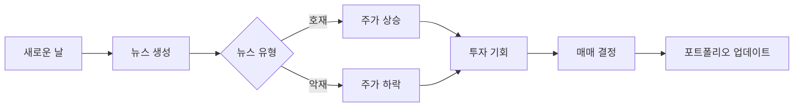

## 💙 Woori FISA PJ

<div align="center">


[](https://github.com/우리FISA조직명)
[](https://github.com/orgs/우리FISA조직명/people)
[](https://github.com/우리FISA조직명)

</div>

---

## 📋 Repository Management
Woori FISA 팀의 레포지토리 관리 페이지입니다.

---

## 📁 Current Repositories

### 🎓 Learning Repository
<div align="left">

**📚 [github-study](https://github.com/FISA-STUDY/Github-study)**


```
📝 Description: Git Bash를 활용한 Git/GitHub 학습 및 실습
🎯 Goal: Git 명령어 숙달 및 협업 워크플로우 이해
📅 Duration: 3일간 스터디 완료
✅ Achievement: Git 기본 명령어 및 브랜치 전략 마스터
```

</div>

### 🚀 Project Repository
<div align="left">

**💰 [mock-investment-game](https://github.com/FISA-STUDY/mock-investment-game)**


```
📝 Description: Java 기반 모의투자게임 프로젝트
🎯 Goal: 뉴스 기반 실시간 주식 시뮬레이션 게임
💡 Core Features: 
  - 📰 일일 뉴스 시스템 (호재/악재 자동 생성)
  - 📈 뉴스 기반 주식 가격 변동 시뮬레이션
  - 💰 주식 매매 (매수/매도)
  - 🔍 주식 시세 조회 및 차트 분석
  - 📊 개인 포트폴리오 관리 및 수익률 추적
  - ⏰ 일별 시간 진행 시스템
📅 Timeline: 3일간 개발 완료
```

</div>

---

## 📊 Repository Status Overview
<div align="center">

| Repository | Status | Language | Purpose | Progress |
|------------|--------|----------|---------|----------|
| **github-study** |  |  | 학습 |  |
| **mock-investment-game** |  |  | 프로젝트 |  |

</div>

---

## 🛠️ Tech Stack
<div align="center">

### Github-STUDY


### Mock Investment Game


</div>

---

## 🎮 Mock Investment Game Features

<div align="center">

### 🎯 핵심 게임 시스템
| 기능 | 설명 | 상태 |
|------|------|------|
| 📰 **일일 뉴스 시스템** | 매일 호재/악재 뉴스 자동 생성 |  |
| 📈 **주가 변동 엔진** | 뉴스에 따른 주식 가격 변동 |  |
| ⏰ **시간 진행 시스템** | 일별 시간 흐름 및 이벤트 관리 |  |

### 💰 투자 관리 기능
| 기능 | 설명 | 상태 |
|------|------|------|
| 🛒 **주식 매매** | 주식 매수/매도 주문 처리 |  |
| 🔍 **주식 조회** | 개별 종목 정보 및 차트 분석 |  |
| 📊 **포트폴리오 조회** | 보유 종목 및 수익률 추적 |  |

### 🎲 게임 특별 기능


### 🏆 게임 성과 지표


</div>

---

## 📈 Activity Stats
<div align="center">


</div>
---
